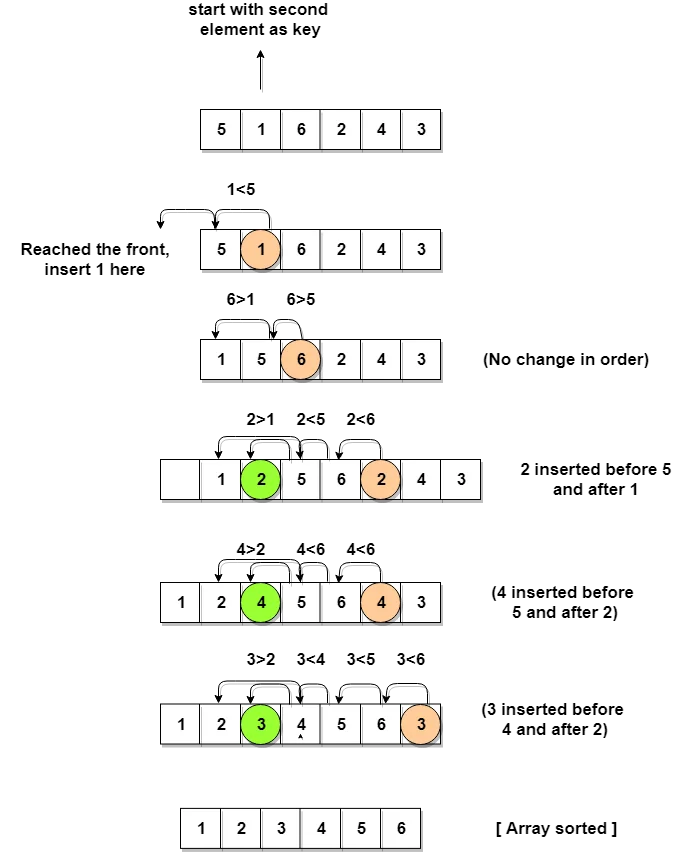

# Insertion Sort

Insertion sort is a sorting algorithm that builds the final sorted array (or list) one item at a time. It is much less efficient on large lists than more advanced algorithms such as quicksort, heapsort, or merge sort.

## Algorithm

1. Insertion sort iterates, consuming one input element each repetition, and growing a sorted output list.
2. At each iteration, insertion sort removes one element from the input data, finds the location it belongs within the sorted list, and inserts it there.
3. It repeats until no input elements remain.
