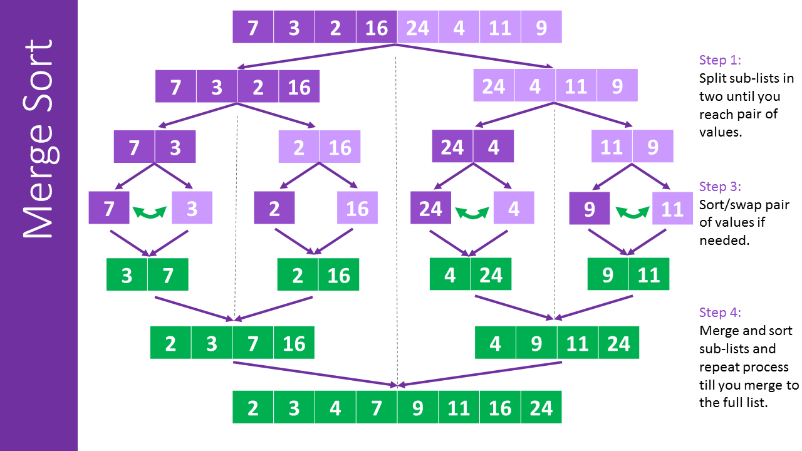

# Merge Sort

Merge sort is a sorting algorithm that uses the divide and conquer approach. It divides the input array into two halves, calls itself for the two halves, and then merges the two sorted halves. The merge() function is used for merging two halves.

## Algorithm

1. Divide the unsorted list into n sublists, each containing 1 element (a list of 1 element is considered sorted).
2. Repeatedly merge sublists to produce new sorted sublists until there is only 1 sublist remaining. This will be the sorted list.

## Problem

Given an array of integers, sort the array in ascending order using the Merge Sort algorithm above. Once sorted, print the array as a single line of space-separated integers.

### Example

arr = [1, 3, 5, 9, 13, 22, 27, 35, 46, 51, 55, 83, 87, 23]
mergeSort(arr) = [1, 3, 5, 9, 13, 22, 23, 27, 35, 46, 51, 55, 83, 87]
