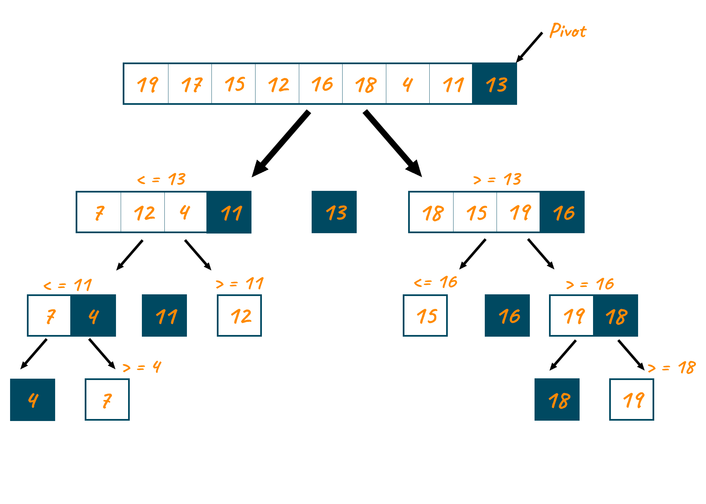

# Quick Sort

Quick sort is a sorting algorithm that uses the divide and conquer approach. It picks an element as pivot and partitions the given array around the picked pivot.

## Algorithm

1. Pick an element, called pivot, from the array.
2. Partitioning: reorder the array so that all elements with values less than the pivot come before the pivot, while all elements with values greater than the pivot come after it (equal values can go either way).
3. Recursively apply the above steps to the sub-array of elements with smaller values and separately to the sub-array of elements with greater values.
